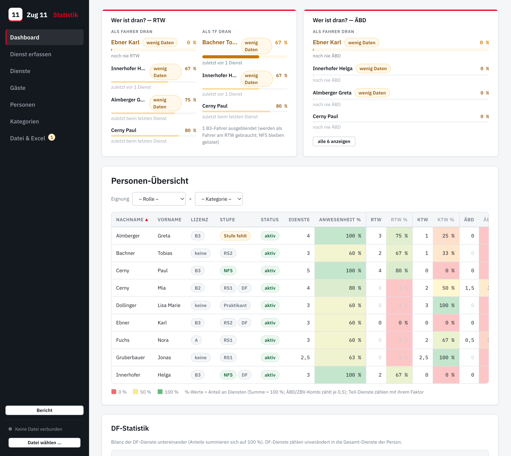
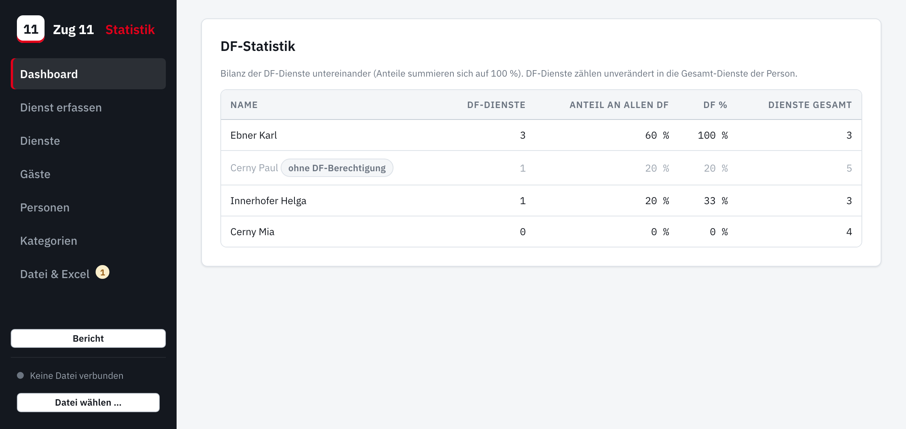
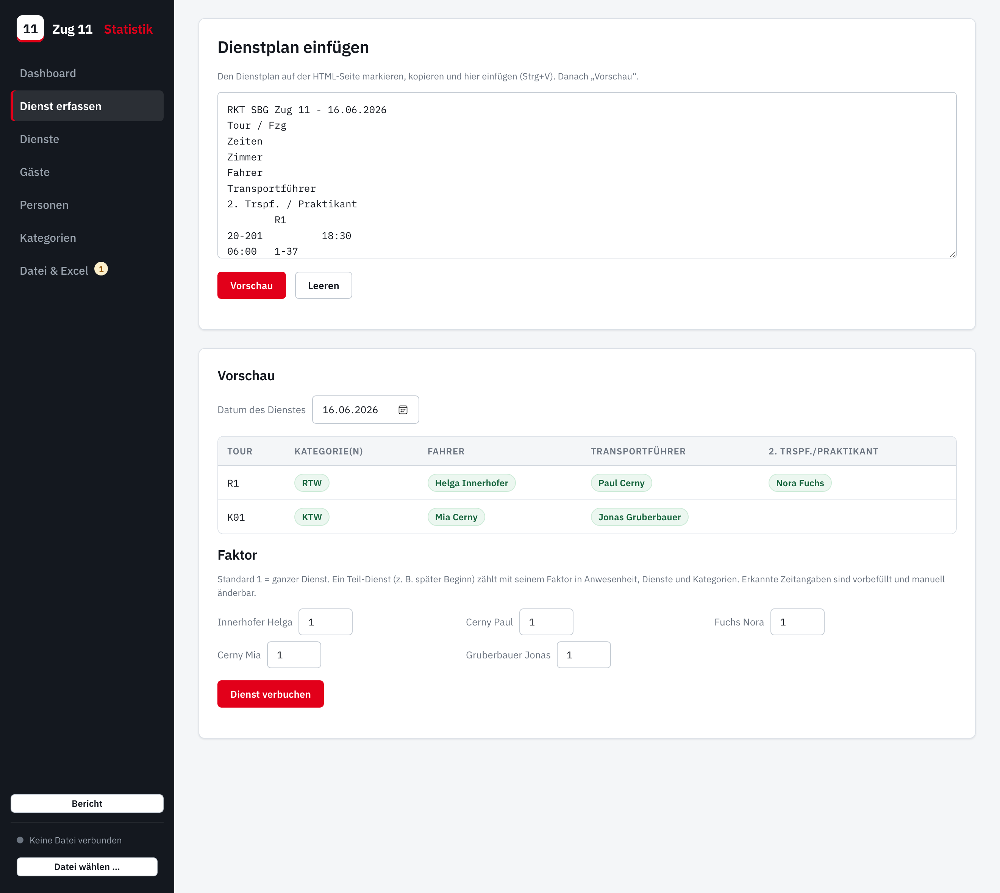
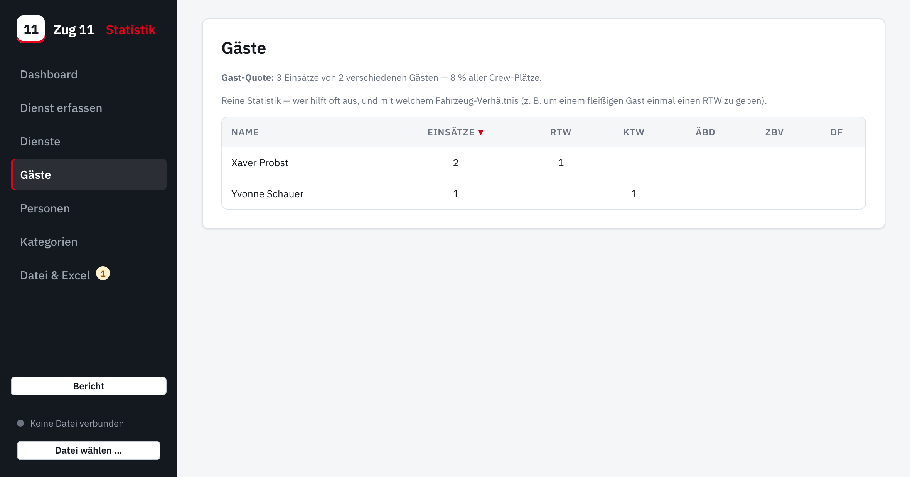
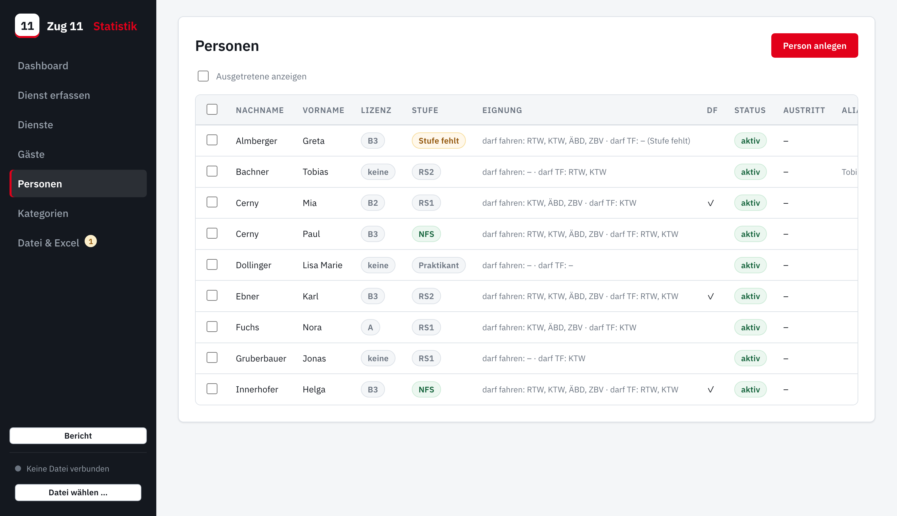
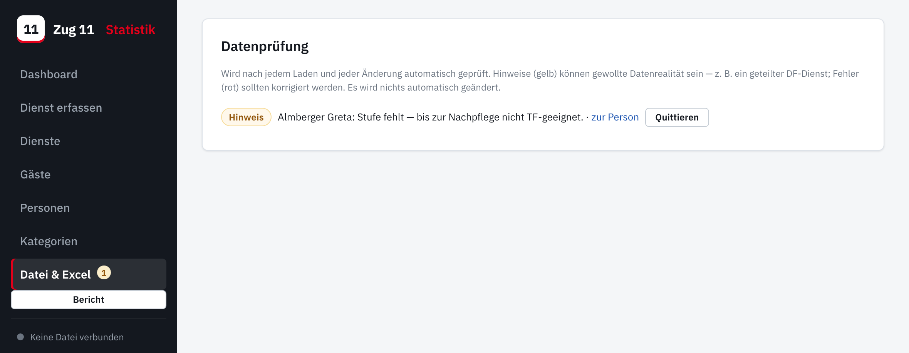

# Zug 11 Statistik — Handbuch

Vollständige Erklärung der App: wie sie aufgebaut ist, was die einzelnen
Ansichten tun und welche Idee jeweils dahintersteckt. Für die *erstmalige
Einrichtung* gibt es die separate Kurzanleitung **INBETRIEBNAHME**.

---

## 1. Was die App ist

Ein Werkzeug für das Zugskommando, um geleistete **Dienste** (RTW / KTW / ÄBD /
ZBV / DF) zu erfassen und fair auszuwerten. Sie ersetzt die früher von Hand
gepflegte Excel-Statistik.

- **Eine einzige Datei, kein Server.** Die ganze App ist eine Datei
  (`index.html`). Alle Daten stehen in genau einer JSON-Datei
  (`Statistik.json`) im geteilten OneDrive-Ordner. Es gibt keine Datenbank und
  keine Anmeldung.
- **Keine Internet-Aufrufe zur Laufzeit.** Die App lädt nichts nach; sie
  funktioniert auch offline. Schrift und die Excel-Bibliothek liegen lokal bei.
- **Bedienung im Browser**, am besten Microsoft Edge (siehe Abschnitt 7).

> **Grundprinzip:** Die `Statistik.json` ist die *eine Wahrheit*. Wer diese
> Datei hat, hat die komplette Statistik. Backups macht man über den
> Excel-Export.

---

## 2. Aufbau der Oberfläche

Links die dunkle **Seitenleiste** mit:

- der **Navigation** (Dashboard, Dienst erfassen, Dienste, Gäste, Personen,
  Kategorien, Datei & Excel),
- dem **„Bericht“-Knopf** (Druckansicht, Abschnitt 5),
- der **Statuszeile** ganz unten (verbunden / manueller Modus) mit einem
  kleinen **Zahlen-Badge** an „Datei & Excel“, sobald die Datenprüfung etwas
  zu melden hat.

Rechts der jeweils gewählte Arbeitsbereich.

---

## 3. Grundkonzepte

Diese fünf Begriffe erklären praktisch alle Zahlen in der App.

### 3.1 Personen: Fahrlizenz **und** Stufe

Jede Person hat zwei unabhängige Eigenschaften:

- **Fahrlizenz**: `keine`, `A`, `B2` oder `B3` — was die Person fahren darf.
- **Stufe**: `Praktikant`, `RS1`, `RS2` oder `NFS` — die sanitätsdienstliche
  Ausbildung.

Daraus leitet die App automatisch ab, wofür jemand **als Fahrer** bzw. **als
Transportführer (TF)** geeignet ist. Zwei Sonderregeln:

- Ein **Praktikant** hat nie eine Fahrlizenz (fährt nur als 2. Trspf. mit).
- Fehlt die Stufe (**„Stufe fehlt“**), gilt die Person vorerst als *nicht
  TF-geeignet* — die Fahr-Eignung aus der Lizenz funktioniert normal. Solche
  Personen lassen sich mit einem Klick auf das gelbe „Stufe fehlt“ direkt
  nachpflegen.

### 3.2 Kategorien & Eignung

Standardmäßig gibt es **RTW, KTW, ÄBD, ZBV, DF**. Jede Kategorie weiß, welche
Tour-Codes im Dienstplan zu ihr gehören (Präfixe wie `R` → R1, R2 …; oder
genaue Codes wie `ÄBD`) und wer für sie geeignet ist:

| Kategorie | Fahrer-Eignung | TF-Eignung |
|-----------|----------------|------------|
| RTW | B3 | RS2, NFS |
| KTW | A, B2, B3 | RS1, RS2, NFS |
| ÄBD | A, B2, B3 | — (kein TF) |
| ZBV | A, B2, B3 | — (kein TF) |
| DF  | über das DF-Häkchen der Person | — |

### 3.3 Der Teil-Dienst-Faktor

Normal zählt ein Dienst als **1**. Wer nur einen Teil mitfährt (z. B. später
Beginn), bekommt einen **Faktor** zwischen 0 und 1. Dieser Faktor wirkt
**einheitlich** auf alles: Anwesenheit, Dienste-Zählung und die Kategorie des
Dienstes zählen dann mit diesem Bruchteil.

Der Parser erkennt eigene Zeitangaben im Dienstplan automatisch: steht z. B.
hinter einem Namen `22:00 - 06:00` und die Tour ging `18:30 - 06:00`, rechnet
die App `8,0 h ÷ 11,5 h ≈ 0,7`. Der Wert ist in der Vorschau vorbefüllt und
von Hand änderbar.

### 3.4 Die 0,5-Regel (ÄBD/ZBV-Kombi)

Ein kombinierter Dienst **ÄBD/ZBV** zählt **je 0,5** für ÄBD und ZBV (mal
Faktor: mit 0,7 also 0,35 / 0,35). Dadurch gilt immer:
**Summe aller Kategorie-Werte einer Person = ihre Dienste.** Die
Prozent-Anteile einer Person können deshalb nie über 100 % steigen.

### 3.5 Anwesenheit

Eine Person wird **ab ihrem ersten Auftreten** im Plan erwartet. An einem
erfassten Dienst, an dem sie nicht eingeteilt ist, gilt sie als abwesend.
Anwesenheit = anwesende (ggf. anteilige) Dienste ÷ erwartete Dienste.

<!-- pagebreak -->

## 4. Die Ansichten im Detail

### 4.1 Dashboard

**„Wer ist dran?“-Karten** (oben): je Fairness-Kategorie eine Karte, bei RTW
getrennt nach **Fahrer** und **TF**. Gereiht wird nach:

1. niedrigster Anteil dieser Kategorie an den eigenen Diensten,
2. bei Gleichstand: am längsten her (》nie《 zuerst),
3. dann: wenigste Dienste insgesamt.

Der **erste Platz ist hervorgehoben** — er ist „am ehesten dran“. Standard sind
4 Kandidaten sichtbar, aufklappbar auf alle. Wer weniger als 5 Dienste hat,
bekommt ein **„wenig Daten“**-Zeichen (wird normal gereiht, aber man sieht die
dünne Basis).

> **TF × RTW – NFS-Ausnahme:** In der RTW-TF-Spalte (und im gleichnamigen
> Filter) werden **B3-Fahrer ausgeblendet**, weil sie als Fahrer am RTW
> gebraucht werden — **außer sie sind NFS**: jeder RTW braucht mindestens
> einen NFS, der meist als TF mitfährt. Eine Fußnote nennt die Zahl der
> ausgeblendeten Fahrer.

**Personen-Übersicht** (Tabelle): je aktiver Person Lizenz, Stufe, Status,
Dienste, Anwesenheit und je Kategorie Anzahl + Anteil. Die **Prozent-Spalten
sind als Heatmap eingefärbt** (Rot 0 % → Gelb 50 % → Grün 100 %). Spalten sind
**sortierbar**; oben lässt sich nach **Eignung (Rolle × Kategorie)** filtern.

> Nicht-berechtigte Kategorien sind ausgegraut — **außer KTW**: dort fahren
> auch Praktikanten als 2. Trspf. mit, deshalb graut KTW nie aus.

**DF-Statistik** (Karte darunter): eigene Bilanz der DF-Dienste.

- **Anteil an allen DF** = Bilanz der DF-Leistenden untereinander (summiert
  sich auf 100 %).
- **DF %** = DF-Dienste ÷ eigene Gesamt-Dienste (wie die anderen Kategorie-%).
- Personen mit DF-Diensten, aber ohne DF-Häkchen, werden markiert.
- *Diese Tabelle ist bewusst noch provisorisch — Layout-Rückmeldung vom
  Kommando willkommen.*

<!-- pagebreak -->

### 4.2 Dienst erfassen

Hier wird der von der Dienstplan-Webseite kopierte Plan eingefügt und per
**„Vorschau“** ausgewertet.

Die App erkennt automatisch:

- **Datum**, alle **Touren** und deren **Kategorie(n)**,
- die **Crew je Spalte** (Fahrer / TF / 2. Trspf.) inkl. der **Rolle**,
- **Zeitangaben** → Faktor (siehe 3.3).

Namen werden zugeordnet:

- bekannte Mitglieder automatisch;
- unbekannte Namen werden als **Gast** vorgeschlagen;
- sieht ein Name einem Mitglied verdächtig ähnlich (Tippfehler wie
  *Christina/Christine*), landet er zur Sicherheit in der **Unklar-Liste** mit
  Vorschlag — er wird *nicht* still als Gast verbucht.

Neue Mitglieder lassen sich direkt in der Vorschau anlegen. Unbekannte
Tour-Codes können einer Kategorie zugeordnet werden. Mit **„Dienst verbuchen“**
wird der Dienst gespeichert; existiert das Datum schon, fragt die App
**Überschreiben** oder **Zusammenführen**.

### 4.3 Dienste

Liste aller erfassten Dienste (Datum, Anzahl Personen, Gäste, Kategorien). Über
**„Öffnen“** lässt sich ein Dienst nachbearbeiten: Kategorien je Person an-/
abhaken, **Faktor** setzen (gültig 0 bis 1), **Gäste** ansehen und für
Alt-Einträge die **Kategorie nachtragen**.

### 4.4 Gäste

Oben die **Gast-Quote** (wie viele Crew-Plätze von Gästen gefüllt wurden),
darunter je Gast die Einsätze nach Kategorie. Bewusst reine Statistik (keine
Verwaltung) — damit man sieht, wer oft aushilft und mit welchem
Fahrzeug-Verhältnis (z. B. um einem fleißigen Gast einmal einen RTW zu geben).

### 4.5 Personen

Anlegen, bearbeiten, auf „ausgetreten“ setzen. Ausgetretene lassen sich hier
einblenden (im Dashboard erscheinen immer nur Aktive). Über die
**Auswahlkästchen** mehrere Personen markieren und gemeinsam bearbeiten
(**„Bearbeiten …“**): nur die im Dialog gewählten Felder werden gesetzt, der
Rest bleibt auf „— unverändert —“. Die Praktikant-Regel gilt auch hier.

### 4.6 Kategorien

Verwaltung der Kategorien: Bezeichnung, **Präfixe** (z. B. `R`) und **Codes**
(z. B. `ÄBD`, `ÄND`), ob es eine **Fairness-Kategorie** ist (taucht in den
Dran-Karten auf) und die **Eignungslisten** (Fahrlizenzen / Stufen) bzw. das
DF-Häkchen. Beim Verbuchen eines unbekannten Codes kann hier direkt eine neue
Kategorie entstehen.

### 4.7 Datei & Excel

- **Statistik-Datei**: verbinden / neu anlegen (siehe INBETRIEBNAHME).
- **Excel-Import**: übernimmt einmalig die alte Mappe (altes „ÄND“ → ÄBD,
  DF-Berechtigungen werden zur Bestätigung vorgeschlagen).
- **Excel-Export**: aktueller Stand als `.xlsx` (Backup/Weitergabe).
- **Datenprüfung** (siehe unten).

Die **Datenprüfung** läuft nach jedem Laden und jeder Änderung und macht
Auffälligkeiten sichtbar — sie korrigiert **nie** automatisch:

- **Gelbe Hinweise** (können gewollt sein): zwei DF am selben Termin
  (geteilter Dienst); Personen mit fehlender Stufe. Hinweise lassen sich
  **quittieren** (dauerhaft ausblenden, wird in der Datei gespeichert); das
  Badge zählt nur offene.
- **Rote Fehler** (sollten korrigiert werden): Faktor/Anwesenheit außerhalb des
  gültigen Bereichs, doppelte Datums-Einträge, verletzte „Summe = Dienste“.
  Fehler sind nicht quittierbar.

Beim Laden werden außerdem **redundante 0-Werte** (Abwesenheit ohne Dienst, die
sich von selbst ergibt) automatisch bereinigt und im Hinweis beziffert.

<!-- pagebreak -->

## 5. Bericht (Druck / PDF)

Der **„Bericht“-Knopf** öffnet eine aufgeräumte Druckansicht (A4 quer, eine
Zeile pro Person, Prozent-Zellen mit der vollen Heatmap-Farbskala). Über den
normalen Browser-Druck (**Strg + P**) lässt sich daraus auch ein **PDF**
speichern.

## 6. Was in der `Statistik.json` steckt

Aktuelles Schema: **Version 4**. Grobaufbau:

- `people` — Personen mit `fahrlizenz`, `stufe`, `df`, `status`, `aliases` …
- `categories` — Kategorien mit Präfixen/Codes und Eignungslisten.
- `evenings` — die Dienste: je Person eine Liste von `{kat, rolle}`; der
  Teil-Dienst-Faktor steht in `partials`; `gaeste` sind Objekte
  `{name, kats:[{kat, wert}], rolle}`.
- `gastListe` — bestätigte Gäste (kein erneutes Nachfragen).
- `quittierungen` — quittierte Datenprüfungs-Hinweise.

> Ältere Dateien (Version 1–3) werden beim Laden **automatisch und verlustfrei**
> auf Version 4 gehoben; einmalig erscheint ein Hinweis, der beim nächsten
> Speichern dauerhaft übernommen wird. Interne Feldnamen (`evenings`, `date` …)
> bleiben dabei unverändert — in der Oberfläche heißt alles „Dienst/Dienste“.

## 7. Warum nur Edge (über https)

Damit die App **direkt in die eine gemeinsame Datei speichern** kann, nutzt sie
eine Browser-Funktion namens **File System Access API**. Diese gibt es **nur in
Chromium-Browsern** (Edge, Chrome, …) — **Safari und Firefox haben sie aus
Datenschutzgründen bewusst nicht eingebaut**; dort schaltet die App in den
manuellen Modus (Laden/Download). Die Funktion verlangt zudem einen **sicheren
Kontext (https)**, weshalb die App über die GitHub-Pages-Adresse geöffnet wird
und nicht per Doppelklick (`file://`). Dass Edge sich die Datei merken darf
(„Wieder verbinden“), gehört zur selben Funktion.

## 8. Für Technik & Wartung

- **Eine Datei, kein Build.** `index.html` enthält HTML, CSS und JS. Der
  Logik-Kern liegt im markierten **`CORE`-Block** und ist ohne Browser testbar.
- **Tests** (im Ordner `tests/`):
  - `run-tests.sh` — Unit-Tests mit anonymisierten Beispieldaten.
  - `check-real-data.sh` — Abgleich gegen die echten Referenzdateien in
    `referenz/` (lokal, **gitignored**; ohne diese Dateien wird übersprungen).
- **Echte Personendaten** (`referenz/`, `Statistik.json`, Exporte) sind per
  `.gitignore` ausgeschlossen und gehören nie ins Repo.
- **Gestaltung** über eine Token-Schicht (Farben/Abstände als CSS-Variablen);
  Schrift IBM Plex liegt lokal in `fonts/`. Die Excel-Funktion nutzt das lokal
  beigelegte SheetJS in `vendor/`.
- **Neue Funktionen** sind als benannte `FEATURE`-Blöcke gekapselt, damit sie
  einzeln nachvollziehbar und rückstandsfrei entfernbar bleiben.
- **Veröffentlichung**: Push auf `main` → GitHub Pages aktualisiert die
  Live-Adresse automatisch. Versionsverlauf siehe `CHANGELOG.md`.
