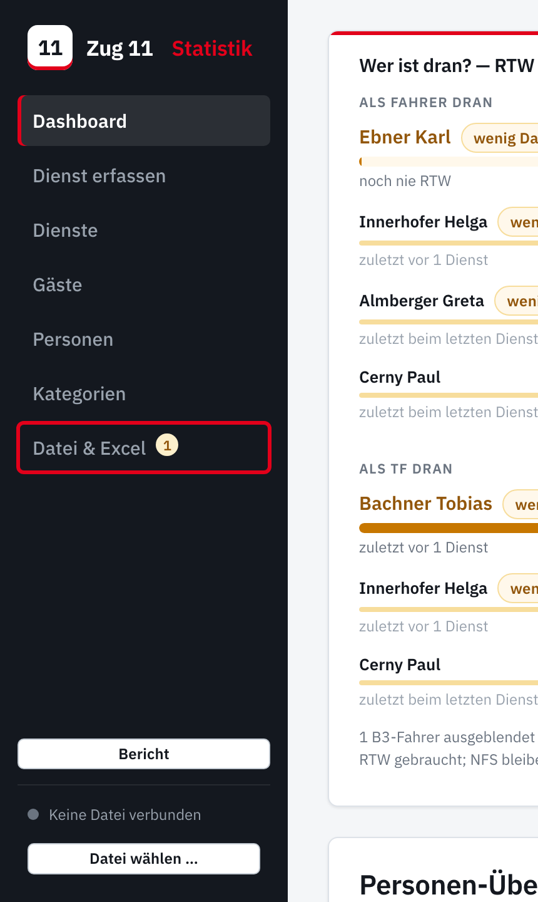
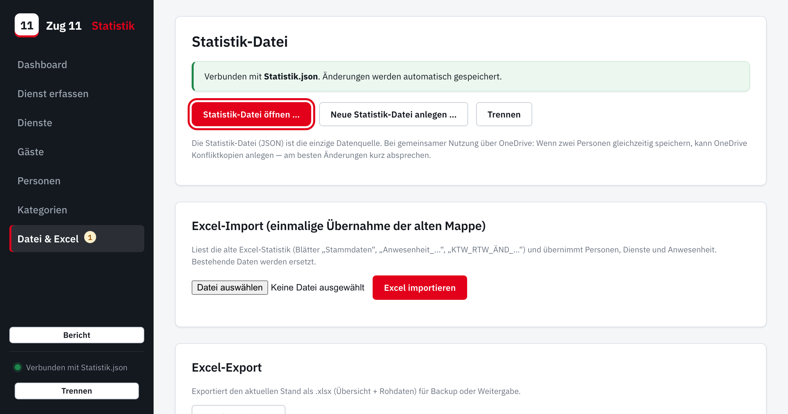
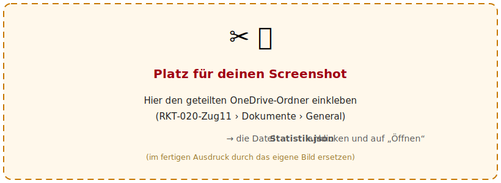

# Zug 11 Statistik — Schnellstart

So verbindest du die App mit der gemeinsamen Datei `Statistik.json`.
**Sechs Schritte, fertig.**

> **Wichtig:** Immer in **Microsoft Edge** und immer über die **Web-Adresse**
> öffnen (nicht per Doppelklick auf eine Datei). Nur so kann die App
> automatisch speichern. *(Warum: siehe ganz unten.)*

---

### Schritt 1 — Edge öffnen

Microsoft **Edge** starten (das blaue „e“).

### Schritt 2 — Website öffnen

Oben in die Adresszeile eingeben und Enter drücken:

**https://matthiashollinger-netizen.github.io/Zugstatistik/**

> Tipp: mit **Strg + D** als Lesezeichen speichern — dann beim nächsten Mal
> nur noch anklicken.

### Schritt 3 — „Datei & Excel“ öffnen

Links in der dunklen Leiste unten auf **„Datei & Excel“** klicken.

### Schritt 4 — „Statistik-Datei öffnen …“

Auf die rote Schaltfläche **„Statistik-Datei öffnen …“** klicken.

<!-- pagebreak -->

### Schritt 5 — Datei auswählen

Im Fenster, das aufgeht, den **geteilten OneDrive-Ordner** des Zuges öffnen,
die Datei **`Statistik.json`** anklicken und auf **„Öffnen“**.

> Falls Edge fragt, ob die Website die Datei bearbeiten darf: auf
> **„Bearbeiten zulassen“** klicken.

### Schritt 6 — Fertig

Unten links wird der Punkt **grün** und es steht **„Verbunden mit
Statistik.json“**. Ab jetzt speichert die App **alles automatisch**.

---

## Beim nächsten Mal

Edge öffnen → Lesezeichen → oben auf **„Wieder verbinden“** klicken. Fertig.

## Wenn unten „Manueller Modus“ steht

Dann wurde die App nicht über die Web-Adresse geöffnet oder es ist nicht Edge.
**Lösung:** die Web-Adresse aus Schritt 2 in **Edge** verwenden. *(Im
manuellen Modus geht alles trotzdem — nur ohne Auto-Speichern: „Datei laden“
und nach Änderungen „Datei speichern“.)*

## Warum nur Edge?

Zum automatischen Speichern in die gemeinsame Datei braucht die App eine
Funktion, die es **nur in Edge/Chrome** gibt — **Safari und Firefox** haben sie
aus Sicherheitsgründen nicht. Und sie funktioniert nur über eine echte
**Web-Adresse (https)**, nicht per Doppelklick von der Festplatte.
