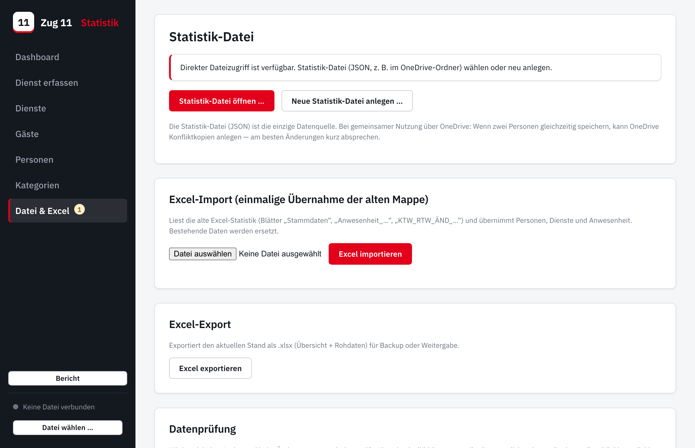
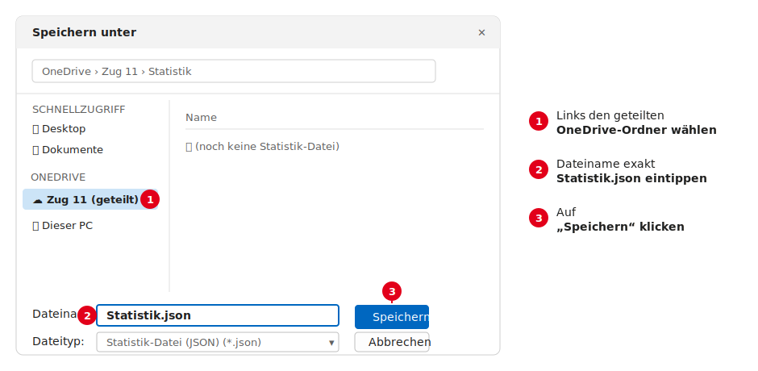
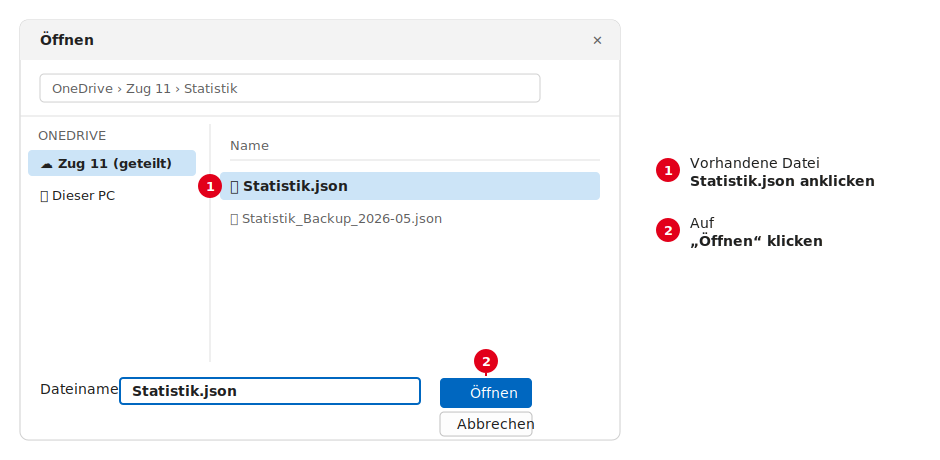
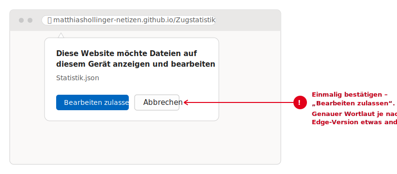
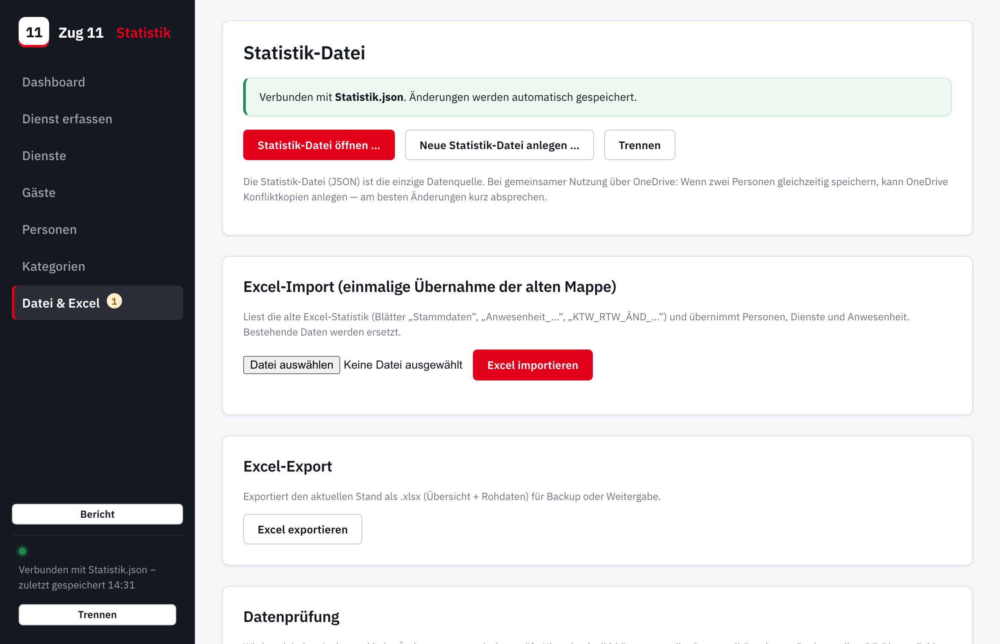
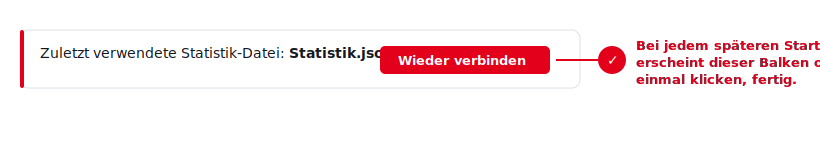

# Zug 11 Statistik — Inbetriebnahme

**Schritt-für-Schritt-Anleitung für den ersten Start.**
Diese Anleitung zeigt, wie die Statistik im Microsoft Edge mit der gemeinsamen
Datei `Statistik.json` (im geteilten OneDrive-Ordner) verbunden wird. Wer sie
befolgt, braucht kein Vorwissen.

---

## Was du brauchst

- Einen **Windows-PC** mit **Microsoft Edge** (ist auf jedem Windows
  vorinstalliert — das blaue „e“-Symbol).
- Den geteilten **OneDrive-Ordner** des Zuges, in dem die `Statistik.json`
  liegt bzw. liegen soll.
- Die Web-Adresse der App:
  **https://matthiashollinger-netizen.github.io/Zugstatistik/**

> **Das Allerwichtigste zuerst:** Die App **immer über die Web-Adresse oben
> öffnen** (am besten als Lesezeichen). Öffne die Datei **niemals** per
> Doppelklick auf eine `index.html` auf der Festplatte. Nur über die
> Web-Adresse kann sich die App die Datei merken und automatisch speichern.
> *(Warum das so ist, steht ganz unten unter „Warum nur Edge?“.)*

<!-- pagebreak -->

## Teil A — Der allererste Start (einmalig)

Das macht **eine** Person einmal. Danach ist die Datei eingerichtet und alle
anderen verbinden sich nur noch (Teil B).

### Schritt 1 — App im Edge öffnen

1. **Edge** starten (blaues „e“).
2. Oben in die Adresszeile die Web-Adresse eintippen und Enter drücken:
   `https://matthiashollinger-netizen.github.io/Zugstatistik/`
3. Sinnvoll: mit **Strg + D** ein **Lesezeichen** setzen, dann findest du die
   App beim nächsten Mal sofort wieder.

### Schritt 2 — Zum Bereich „Datei & Excel“

Links in der dunklen Leiste auf **„Datei & Excel“** klicken. Du siehst diesen
Bereich:

> **Hinweis:** Steht hier stattdessen etwas von **„Manueller Modus“**, dann
> wurde die App *nicht* über die Web-Adresse geöffnet (oder es ist nicht Edge).
> Siehe „Wenn etwas nicht klappt“ am Ende.

### Schritt 3 — Datei anlegen **oder** öffnen

**Fall 1: Es gibt noch gar keine `Statistik.json`** (ganz neuer Start)
→ auf **„Neue Statistik-Datei anlegen …“** klicken. Es öffnet sich das
Windows-Fenster „Speichern unter“:

1. Links den **geteilten OneDrive-Ordner** des Zuges auswählen.
2. Als Dateiname genau **`Statistik.json`** eintippen.
3. Auf **„Speichern“** klicken.

**Fall 2: Im OneDrive liegt schon eine `Statistik.json`** (z. B. weil sie schon
einmal angelegt oder aus der alten Excel-Mappe erzeugt wurde)
→ auf **„Statistik-Datei öffnen …“** klicken und die Datei auswählen:

### Schritt 4 — Edge nach der Erlaubnis fragen lassen

Edge fragt einmal nach, ob die Website die Datei bearbeiten darf. Das ist
gewollt — auf **„Bearbeiten zulassen“** klicken:

### Schritt 5 — Fertig: verbunden

Unten links wird der Punkt **grün** und es steht **„Verbunden mit
Statistik.json“**. Ab jetzt speichert die App **jede Änderung automatisch**
direkt in die Datei — du musst nichts weiter tun.

> **Tipp:** Wer eine **alte Excel-Mappe** übernehmen will, macht das **vor**
> dem Verteilen einmalig über **„Datei & Excel → Excel importieren“**. Details
> dazu im Handbuch. Danach normal wie oben speichern.

<!-- pagebreak -->

## Teil B — Jeder weitere Start (täglich)

Beim nächsten Mal ist fast alles automatisch:

1. Edge öffnen, **Lesezeichen** anklicken (oder die Web-Adresse eingeben).
2. Oben erscheint ein Balken mit der zuletzt verwendeten Datei. Einmal auf
   **„Wieder verbinden“** klicken (und, falls Edge nochmal fragt, wieder
   **„Bearbeiten zulassen“**):

3. Der Punkt wird grün — fertig. Weiterarbeiten, alles speichert automatisch.

---

## Teil C — An einem anderen PC / als andere Person

Genau gleich wie Teil A, **Schritt 3, Fall 2**: in „Datei & Excel“ auf
**„Statistik-Datei öffnen …“** und die gemeinsame `Statistik.json` im
OneDrive-Ordner auswählen. Jeder PC merkt sich die Datei danach selbst.

> **Gleichzeitig arbeiten?** Lieber nicht zur selben Zeit dieselbe Datei
> bearbeiten — OneDrive legt sonst „Konfliktkopien“ an. Kurz absprechen, wer
> gerade dran ist. Die App warnt zusätzlich, wenn sich die Datei
> zwischenzeitlich geändert hat.

<!-- pagebreak -->

## Wenn etwas nicht klappt

**Unten steht „Manueller Modus“ statt grün „Verbunden“.**
Die App wurde nicht über die Web-Adresse geöffnet oder es ist nicht Edge. Die
App schreibt den Grund dazu:

- *„per file:// geöffnet“* → Du hast eine Datei auf der Festplatte per
  Doppelklick geöffnet. **Lösung:** stattdessen die Web-Adresse benutzen
  (Lesezeichen).
- *„Browser ohne Direkt-Speichern“* → Du bist in Safari oder Firefox.
  **Lösung:** die App in **Microsoft Edge** (oder Chrome) öffnen.

Im manuellen Modus geht trotzdem alles — nur ohne Automatik: Datei über
**„Datei laden“** öffnen und nach Änderungen über **„Datei speichern“**
herunterladen und im OneDrive-Ordner ersetzen.

**Die Seite sieht alt aus / Änderungen fehlen.**
Einmal **Strg + F5** drücken (lädt die neueste Version).

**Wo liegt meine Datei eigentlich?**
Im geteilten OneDrive-Ordner, als `Statistik.json`. Das ist die einzige
Datenquelle — wer diese Datei hat, hat die ganze Statistik.

**Sicherung.**
Über **„Datei & Excel → Excel exportieren“** lässt sich jederzeit eine
`.xlsx`-Sicherung erzeugen (zum Aufheben oder Weitergeben).

---

## Warum nur Edge (und nicht Safari/Firefox)?

Damit die App **direkt in die eine gemeinsame Datei speichern** kann, braucht
sie eine bestimmte Browser-Funktion (die „File System Access API“). Diese
Funktion gibt es **nur in Edge, Chrome & Co.** — **Safari und Firefox haben
sie aus Sicherheitsgründen bewusst nicht eingebaut**. Dort schaltet die App
automatisch in den umständlicheren manuellen Modus (Laden/Download).

Zusätzlich verlangt diese Funktion eine **echte Web-Adresse (https)** —
deshalb muss die App über die GitHub-Pages-Adresse geöffnet werden und nicht
per Doppelklick von der Festplatte (`file://`). Über die Web-Adresse darf sich
Edge die Datei außerdem merken, daher der bequeme „Wieder verbinden“-Knopf.
